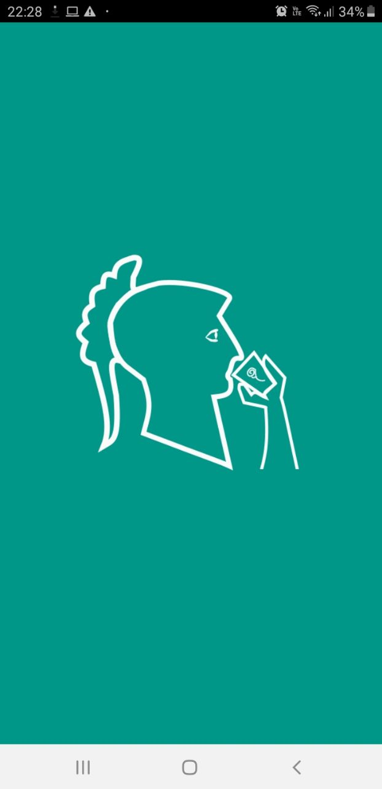
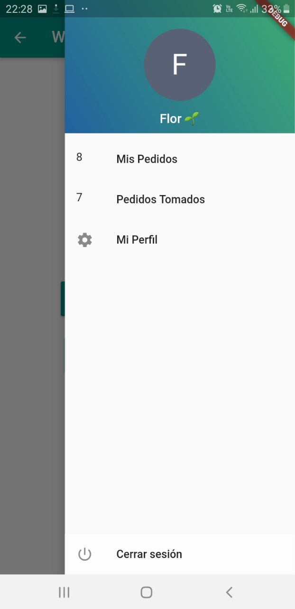
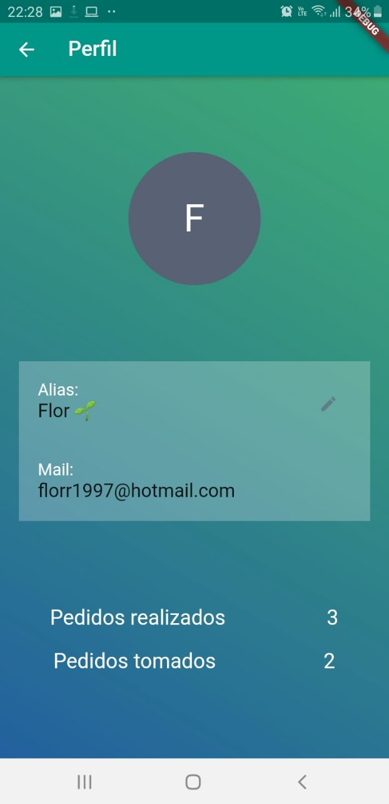
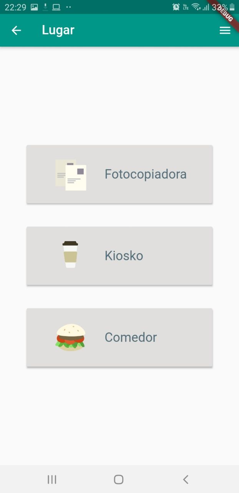
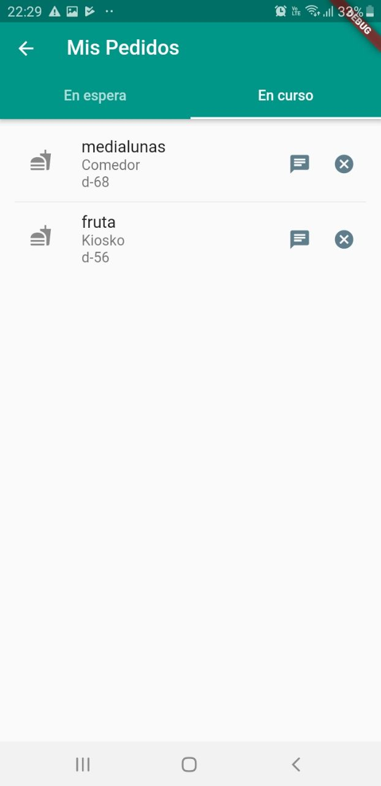

# Wafi

Aplicación para TDL - Presentación de Dart - 2do cuatrimestre 2019

Integrantes:

- Olivia Fernandez
- Rodrigo Souto
- Florencia Rodriguez

Aplicación que permite conectar a los estudiantes de la Facultad de Ingenieria para poder realizar y llevar pedidos dentro de esta.

  
   
  

  
   

